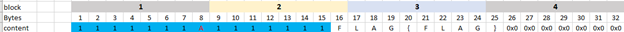

So, when we netcat the server, we got this:

We have to type something, and it will get it+flag encrypted with AES-ECB

### In case you’re not familiar with ECB,you can [read it here](https://en.wikipedia.org/wiki/Block_cipher_mode_of_operation#Electronic_codebook_(ECB))

So,basically the AES-ECB will encrypt/decrypt each block seperately. For example,if you have two
blocks with same content, it will be the same after encrypt using ECB with same
key.

Imagine we have the flag like this, and ECB takes 8 bytes for the block ( for
easier demo, actually it tooks 16 bytes)

And 0x0 , it is the padding ( to fill up the rest of the block)

So, our strategy is, some how we make use of the ( same block content will have
same ciphertext)

We will send the blue to the server, with the red A is our guess to the frist
character of the flag.It will come to B,C,D,E and F.

So now, the First block and the second block have the same content. It will
return the same ciphertext for 2 blocks

After that, we will shift our payload

We will send the blue to the server, with the red A is our guess to the frist
character of the flag.It will come to B,C,D,E,D.. till it reaches L

Now, the first block and the second block have thw same content again. That’s
our algothrim to solve this challenge.

~~~~~~~~~~~~~~~~~~~~~~~~~~~~~~~~~~~~~~~~~~~~~~~~~~~~~~~~~~~~~~~~~~~~~~~~~~~~~~~~
import socket 
from string import *
import base64
host='chall.bsidesalgiers.com'
port= 5002
s=socket.socket(socket.AF_INET, socket.SOCK_STREAM)
s.connect((host, port))
s.recv(4096)

#sometime it will fail at some stage, just type the known flag and it will get the rest of it
flag=''
padding='0'
payload_padding='0'
BLCK_SZ=16
sent=''

len_flag=67
#adjusted from string.printable , for quicker burte 
printable_mod='{_etaoinshrdlcumwfgypbvkjxqzETAOINSHRDLCUMWFGYPBVKJXQZ0123456789!#$%&()*+-?@}~'
for j in range(len(flag),len_flag):
    for i in printable_mod:
        #print("----++++-----")
        sent=flag[-15:]+i
        while (len(sent)<16):
            sent=payload_padding+sent
        sent+=(padding*((16*6)-j-1))
        sent=sent+'\n'
        #print('a-')
        #print(sent)
        s.sendall(sent.encode())
        a=s.recv(2048)
        #print('b-')
        #print(a)
        if(len(a) <20):
            #print('c-')
            a=s.recv(1024)
            #print(a)
        if (a[0:3]==b'The'):
            a=a[13:]
        if (a.decode().find('=>')):
            a=a[:-4]
        #print('d-')    
        #print(a)
        a=base64.b64decode(a).hex()
        #print('e-')
        #print(a)        
        if (a[0:32]==a[192:224]):
            #print("-------------------------FLAG-------------------------------------")
            #print('FLAG:',end="")
            flag+=i
            #print(flag)
            break 

  
print(flag)                     
~~~~~~~~~~~~~~~~~~~~~~~~~~~~~~~~~~~~~~~~~~~~~~~~~~~~~~~~~~~~~~~~~~~~~~~~~~~~~~~~
